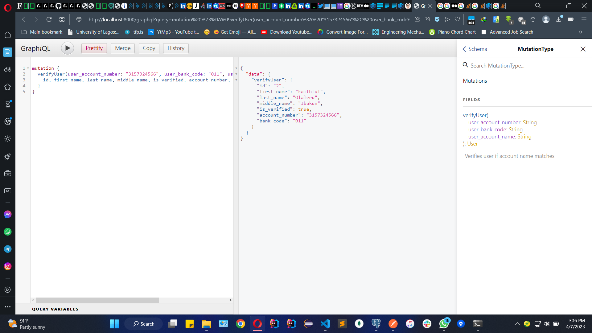
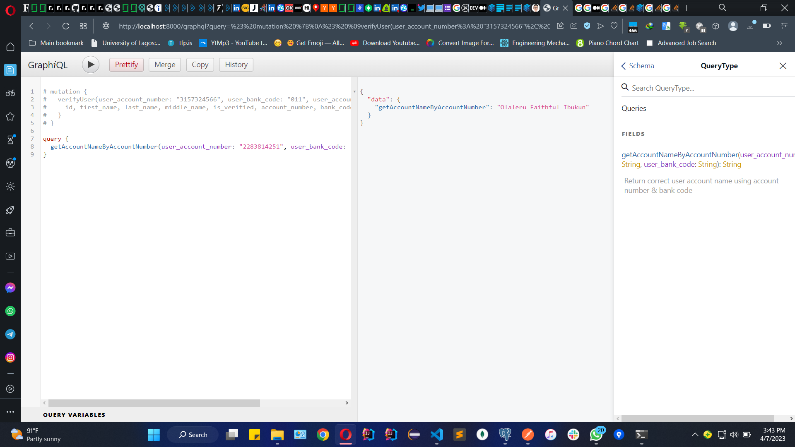

BACKDROP CODING INTERVIEW - EXPRESSJS - SEQUELIZE - POSTGRES - GRAPHQL

SETUP:

-   Install dependencies,
-   Setup your postgres DB locally, check info in config.json
-   setup your .env, check .env.example to follow
-   Follow scripts in package.json to create your migrations & seeders;
    -   if it throws errors that those files exist, just delete files or rename run command again

OBJECTIVE:

-   Interfacing with Paystack bank resolution API
    -   Mutation to verify user if name matches name from Paystack account number lookup
    -   Query to return user name if exists or name from Paystack account number lookup

NOTES:

-   Ideally, User entity & Bank entity should be separate with one to many mappings
    -   check https://github.com/ionknowmyname/Restaurant-Service-Nodejs-Postgres-Sequelize
-   Sequence for id could be improved
    -   check https://www.yugabyte.com/blog/automatic-id-generation-postgresql-nodejs-sequelize/

PICTURES:

(LEVENSHTEIN vs. DAMERAU-LEVENSHTEIN) DISTANCE ALGORITHM

-   Damerau-Levenshtein algorithm also takes into account transpositions in addition to insert, delete and
    substitutions that are in the pure Levenshtein algorithm. We don't want transpositions because of the cliche
    example of 'tea and eat'. For purposes of verifying account name, we should not be able to transpose/swap characters
    to match each other, tea and eat should clearly not match when verifying account name. We should only be able to add
    or remove characters, that's why the pure Levenshtein is better off.
